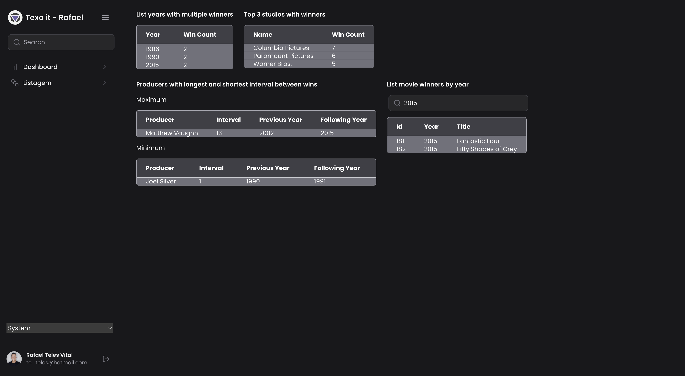
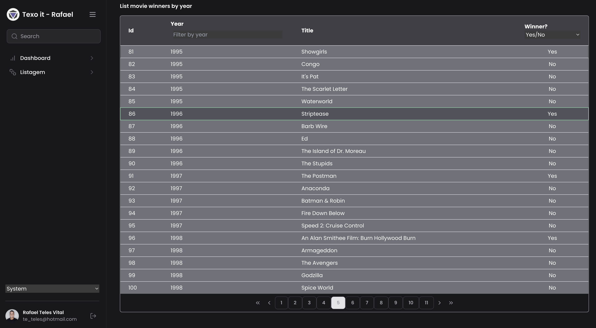
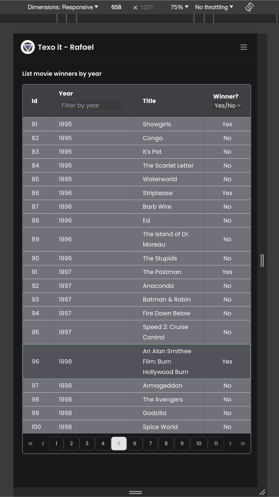
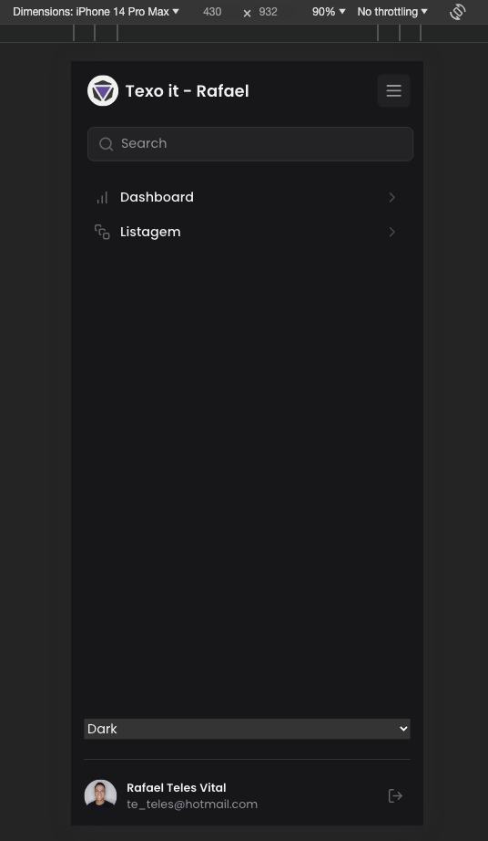

## Tecnologias utilizadas

O projeto foi desenvolvido usando as seguintes tecnologias:

- react
- nextjs(version 14)
- tailwindcss
- axios
- TypeScript
- jest

## Como baixar o projeto e rodar

```bash

  # Clonar o repositório
  git clone git@github.com:DevTeles/texoitteste-rafael.git

  # no .env.local
  NEXT_PUBLIC_API_BASE=https://tools.texoit.com


  # Entrar no diretório
  cd texoitteste-rafael

  # Instalar as dependências
  pnpm install or yarn install or npm install

  # Iniciar o projeto
  pnpm dev

  # Rodar os testes 
  pnpm test
  # ou
  pnpm test:watch
```

## Final result









<br />
Developed by **Rafael Teles Vital**
